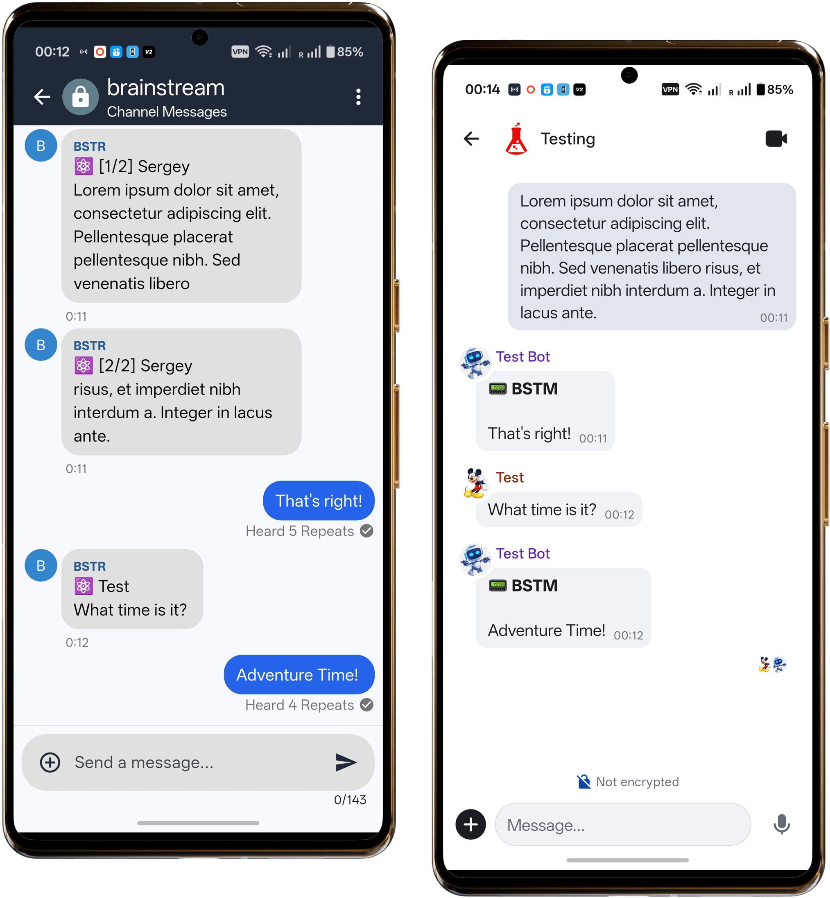

# MeshMatrixCore

Bridge between MeshCore channels and Matrix rooms.

## Docker

To build the Docker image, run:

```sh
docker build -t meshmatrixcore .
```

To run the Docker container, use:

```sh
docker run --rm --device=/dev/ttyACM0:/dev/ttyACM0 --volume=./config.toml:/app/config.toml meshmatrixcore:latest
```

Specify your device path and config file path as needed.

## Development

Install the project with its test dependencies, then run the test suite:

```sh
python -m pip install -e ".[test]"
python -m pytest
```

Tests live in `tests/`, and pytest adds `src/` to the import path so they exercise the source package directly.


